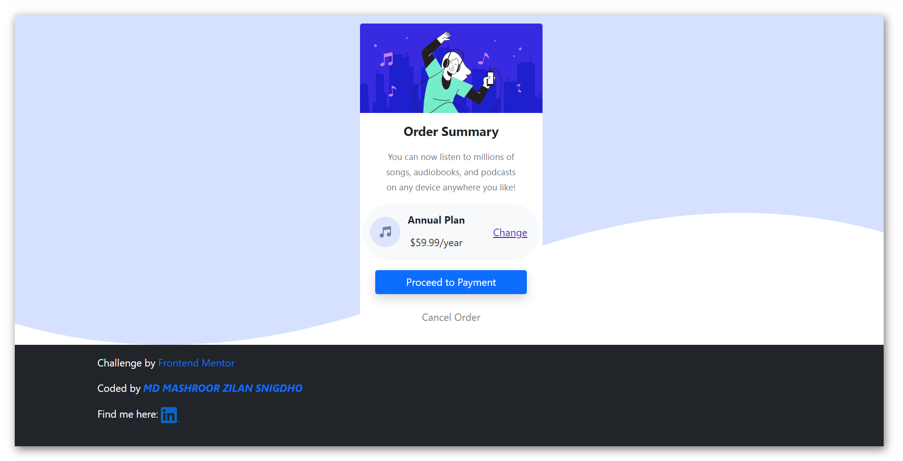

# Frontend Mentor - Order Summary component solution

This is a solution to the [QR code component challenge on Frontend Mentor](https://www.frontendmentor.io/challenges/order-summary-component-QlPmajDUj). Frontend Mentor challenges help you improve your coding skills by building realistic projects.

## Table of contents

- [Overview](#overview)
  - [Screenshot](#screenshot)
  - [Links](#links)
- [My process](#my-process)
  - [Built with](#built-with)
  - [Useful resources](#useful-resources)
- [Author](#author)

## Overview

### Screenshot

### Links

- Solution URL: [https://github.com/mzs21/order-summary-component-](https://github.com/mzs21/order-summary-component-)
- Live Site URL: [https://mzs21.github.io/order-summary-component-/](https://mzs21.github.io/order-summary-component-/)

### Built with

- [Bootstrap](https://getbootstrap.com/) - CSS framework
- [Sass](https://sass-lang.com/) - CSS preprocessor
  .

### Useful resources

- [Bootstrap](https://getbootstrap.com/)
- [Sass](https://sass-lang.com/)

## Author

- Website - [MD MASHROOR ZILAN SNIGDHO](https://github.com/mzs21)
- Frontend Mentor - [mzs21](https://www.frontendmentor.io/profile/mzs21)
- LinkedIn - [mdmzs](https://www.linkedin.com/in/mdmzs/)
- Twitter - [Snigdho21](https://twitter.com/Snigdho21)
